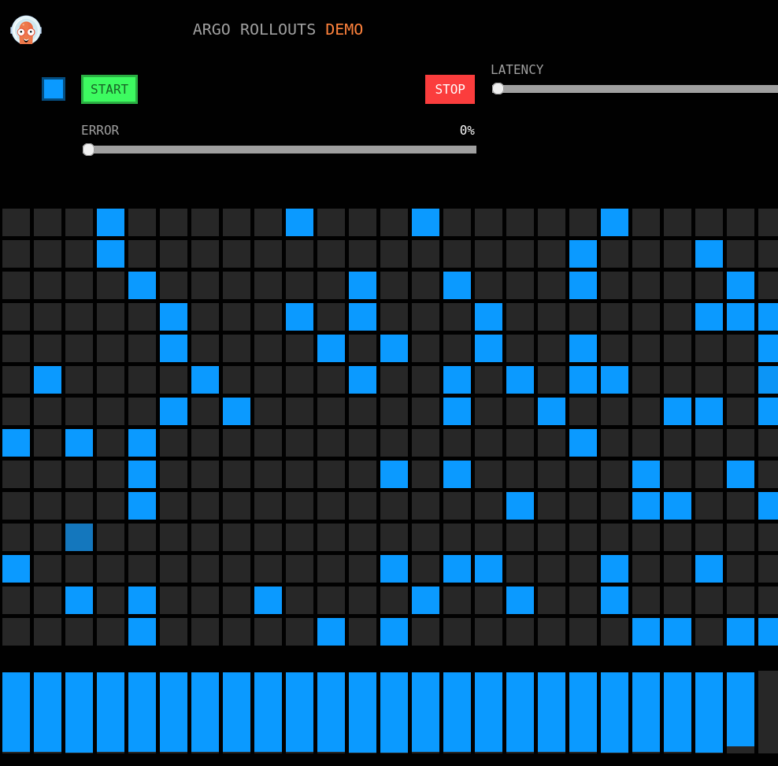

# OpenShift Service Mesh with Argo Rollouts

Example Repo that does what the title says.

# Prereqs

* OpenShift Cluster v4.10+
* [OpenShift Service Mesh (aka Istio) v2.0+](https://docs.openshift.com/container-platform/latest/service_mesh/v2x/preparing-ossm-installation.html)
* [OpenShift GitOps (aka Argo CD) v1.6+](https://docs.openshift.com/container-platform/latest/cicd/gitops/installing-openshift-gitops.html). You can also use [my gist instructions](https://gist.github.com/christianh814/17cf382e18e1e0be16bb212a7c51a804) for a tl;dr version.
* [Argo Rollouts v1.3+](https://argoproj.github.io/argo-rollouts/installation/) (pluin recommended)

# Testing

Highlevel steps to test. These steps assumes you've satisfied the [Prereqs](#prereqs)

## Fork the repo

First, fork this repo. You will need to change the [example-sm-canary.yaml](example-sm-canary.yaml) file to point to your fork.

## Deploy the Application

After editing the `example-sm-canary.yaml` file to point to your fork, apply it to your OCP cluster

```shell
oc apply -n openshift-gitops -f example-sm-canary.yaml
```

## See the App

You should see the app on your browser; first export your Gateway

```shell
export GATEWAY_URL=$(oc -n istio-system get route istio-ingressgateway -o jsonpath='{.spec.host}')
```

Then open in browser, example

```shell
firefox $GATEWAY_URL
```

You should see this



## Make update

Update the `canary/overlays/openshift/kustomization.yaml` file from `blue` to `yellow`. Edit the file by hand but if you're brave run a sed

```shell
sed -i 's/blue/yellow/g' canary/overlays/openshift/kustomization.yaml
```

Then commit/push to your fork

```shell
git add .
git commit -am "yellow"
git push
```


## Observe

Get status using the plugin (running a `watch` is helpful)

```shell
oc argo rollouts get rollout rollouts-demo -n canary
```

You'll see that the blue squares turn into yellow ones. It increases every 10 seconds until you're fully yellow
